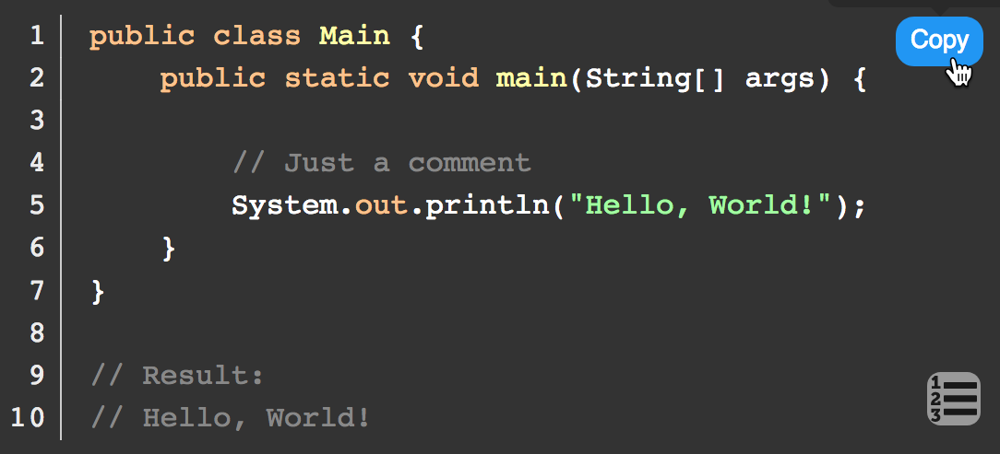

# Code-Line.js

Code-line.js is a lightweight plugin, it finds every `<pre><code>...` in your page, and append line numbers. Most of the features are dependent on CSS to complete, so very flexible & efficient.

It's mainly use with [Highlight.js](https://github.com/isagalaev/highlight.js), but you can also render your code in any way.  

[GitHub Pages](https://js-zheng.github.io/code-line/)

---

## Demo 

Let's demonstrate a "Hello, World!" to you.

(Highlight code by [Highlight.js](https://github.com/isagalaev/highlight.js))


If you like, keep looking down 😆 or see more [Example](https://js-zheng.github.io/code-line/demo/).


---

## Install

### HTML

```html
<script src="https://cdn.jsdelivr.net/npm/code-line"></script>
```

### NPM

```
npm install code-line
```


---

## Getting Started

The only thing you need to do is:

```html
<script>CodeLine.initOnPageLoad()</script>
```  

### Choose the loading time
If you want to customize the loading time:

EX:
```javascript
// May be event-triggered or below the html body
CodeLine.loadLineNumbers()
```

### Nohighlight

Same as the [Highlight.js](https://github.com/isagalaev/highlight.js).  
To disable code-line altogether use the nohighlight class:

```html
<pre><code class="nohighlight">...</code></pre>
```

### Absolute Position

We usually have to trace codes with mobile devices. 


Line-numbers.js use `position: absolute` default.  
As a result, you can slide your screen without losing direction and number.  


If you don't like it, just append your CSS rules, like:

```css
pre.cljs code {
  position: relative;
}  
```

### Soft Wrap

`Hard Wrap` is the default setting of Code-line.
If you want to use `Soft Wrap`, append `soft-wrap` class to your `<code>`:  

```html
<pre><code class="soft-wrap">...</code></pre>
```

### Widget

Currently, CodeLine supports two widgets -- **ToggleButtonFactory** & **LineNumbersToggle**.



It may be useful or annoying, you can enable/disable it whatever you love.

---

### Options


| Name             | Type      | Default                                                                           | Description                                                   |
|------------------|-----------|-----------------------------------------------------------------------------------|---------------------------------------------------------------|
| `minLine`        | {Number}  | 3                                                                                 | Code below `minLine` will not be applied                      |
| `show`           | {Boolean} | true                                                                              | Enable/Disable Line Numbers                                   |
| `showOnMobile`   | {Boolean} | false                                                                             | Enable/Disable Line Numbers on mobile                         |
| `softWrap`       | {Boolean} | false                                                                             | Enable/Disable softwrap                                       |
| `maxMobileWidth` | {Number}  | 420                                                                               | Width below the `maxMobileWidth` will be considered as mobile |
| `copyBtn`        | {Object}  | {show: true, position: 'bottom', showOnMobile: false, positionOnMobile: 'bottom'} | The setting of the `Copy Button`                              |
| `toggleBtn`      | {Object}  | {show: true, position: 'top', showOnMobile: true, positionOnMobile: 'top'}        | The setting of the `Line Numbers Toggle Button`               |

Example:
```html
<script>
  CodeLine.initOnPageLoad({
    showOnMobile: true,
    toggleBtn: {show: true, showOnMobile: false, position: 'bottom'}
  })
</script>
</script>
```