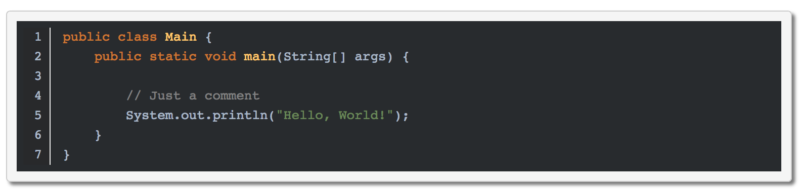
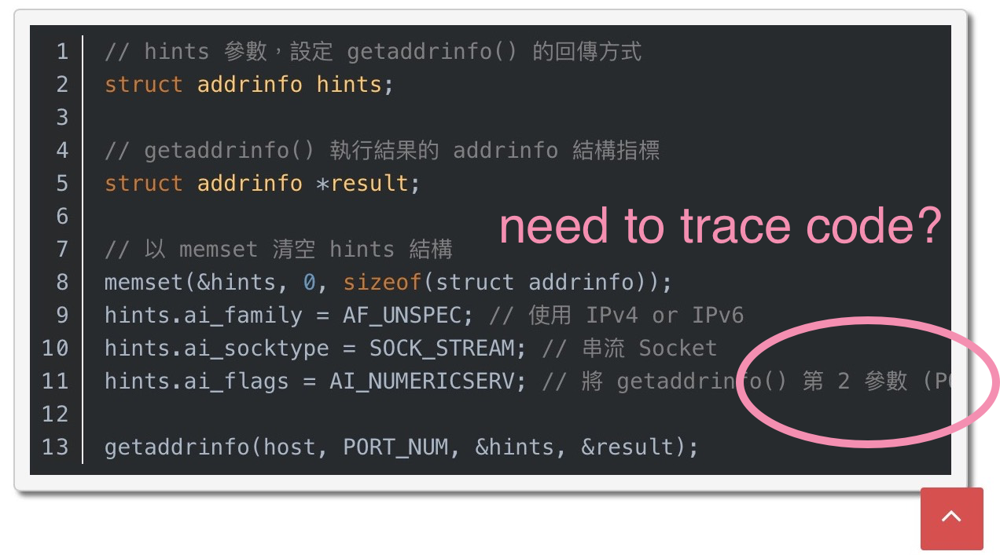

# Line-numbers.js

Line-numbers.js is a lightweight plugin, it finds every `<pre><code>...` in your page, and append line numbers. Most of the features are dependent on CSS to complete, so very flexible & efficient.

It's mainly use with [Highlight.js](https://github.com/isagalaev/highlight.js), but you can also render your code in any way.  

[GitHub Pages](https://jasonnn331.github.io/line-numbers.js/)

---

## Demo 

Let's demonstrate a "Hello, World!" to you.

(Highlight code by [Highlight.js](https://github.com/isagalaev/highlight.js))

 

If you like, keep looking down 😆 or see more [Example](https://jasonnn331.github.io/line-numbers.js/demo/).

---

## Getting Started

The only thing you need to do is:

```html
<link rel="stylesheet" href="/path/to/styles/line-numbers.min.css">
<script src="/path/to/line-numbers.min.js"></script>
<script>lineNums.loadLineNumbers();</script>
```  

### Choose the loading time
If you want to ensure that initialize line-numbers after page load, just use `addEventListener`.  
Of course, you can use the utils directly, like [whenReady.js](src/whenReady.js) which is written by David Flanagan.  
  
EX:
```html
<script src="/path/to/whenReady.js"></script>
<script>whenReady(lineNums.loadLineNumbers);</script>
```

### Nohighlight

Same as the [Highlight.js](https://github.com/isagalaev/highlight.js).  
To disable line-number altogether use the nohighlight class:

```html
<pre><code class="nohighlight">...</code></pre>
```

### Absolute Number

We usually have to trace codes with mobile devices. 



Line-numbers.js use `position: absolute` default.  
As a result, you can slide your screen without losing direction and number.  


If you don't like it, just append your CSS rules, like:

```css
pre.line-numbers code {
  position: relative;
}  
```

### Soft Wrap

`Hard Wrap` is the default setting of Line-numbers.js.  
If you want to use `Soft Wrap`, append `soft-wrap` class to your `<code>`:  

```html
<pre><code class="soft-wrap">...</code></pre>
```


